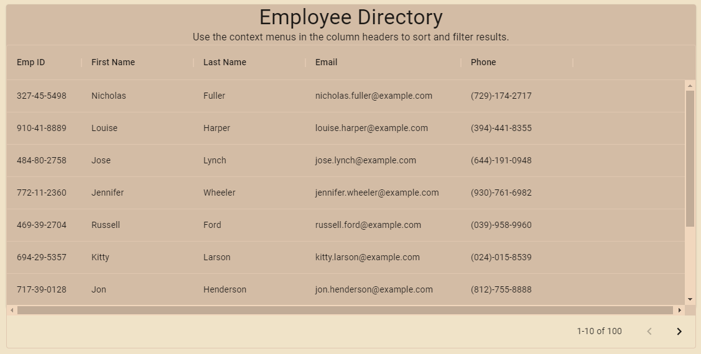

# Employee Directory

## Description
An employee directory allowing users to sort and filter a database of employee data

## Table of Contents 

* [Installation](#installation)

* [Usage](#usage)

* [License](#license)

* [Contributions](#contributions)

* [Testing](#testing)

* [Questions](#questions)

## Installation
npm i

## Usage
People managers can now easily sort and filter their employees to review basic data

## License
Created under the MIT license. See LICENSE.txt for more information.

## Contributions
Not currently accepting contributions

## Testing
no testing libraries installed

## Questions
Have questions on this application? Contact me via: 
Email: jondeavers@gmail.com  
My GitHub Profile: https://github.com/lucsedirae     
